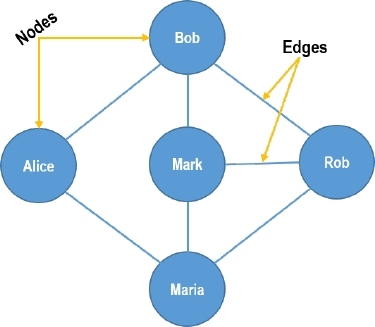

# **Project Title: Social Network Graph**

## **Objective**
To implement a program in C++ that models a simple social network as a graph. The graph is represented as an **adjacency matrix**. Students will use basic data structures (e.g. arrays, multi-dimensional arrays,  vectors, etc) and file I/O operations to manage and manipulate the graph. 
This project will prepare you for cs142 and will helps you to apply key programming concepts like loops, conditionals, functions, and file handling.

---

## **Project Description**

A social network graph is a representation where:
- **Nodes** represent persons in the network.
- **Edges** represent friendships between persons.

The program should allow the user to perform the following operations on the graph:

---

## **Features**

### **0. Load Graph from a File**
- **Input file format:**  
  Each line represents a person and their friends in the format:
  ```
  Person: Friend1,Friend2,Friend3,...
  ```
  **Example:**
  ```
  Alice: Bob,Charlie
  Bob: Alice
  Charlie: Alice
  ```
- The program should parse the file and construct the social network graph.

---

### **1. Print All Friends of Person X**
- The program should prompt the user for a person's name and display their list of friends.  
  **Example:**  
  - Input: `Alice`  
  - Output: `Alice's friends: Bob, Charlie`

---

### **2. Add Friend to Person X**
- The program should allow adding a new friend to an existing person.  
  **Example:**  
  - Input: `Alice, Dave`  
  - Output: `Dave added as a friend to Alice.`  
  - **Note:** Ensure the friendship is mutual (add the link both ways).

---

### **3. Add Person Y to Social Network**
- Add a new person to the graph with no initial friends.  
  **Example:**  
  - Input: `Eve`  
  - Output: `Eve added to the social network.`

---

### **4. Print All Persons and Their Friends**
- Display the entire social network in the format:
  ```
  Alice: Bob, Charlie
  Bob: Alice
  Charlie: Alice
  ```

---

### **5. Check if Person Z is a Common Friend of Person X and Person Y**
- **Input:** `X, Y, Z`  
- **Output:**  
  - `Yes, Z is a common friend.`  
  - or  
  - `No, Z is not a common friend.`

---

### **6. Write Graph to an Output File**
- Save the current state of the graph to an output file in the same format as the input file.  
  **Example:**
  ```
  Alice: Bob,Charlie,Dave
  Bob: Alice
  Charlie: Alice
  Dave: Alice
  ```

---

## **Sample Input/Output**

### **Input File (`social_network.txt`):**
```
Alice: Bob,Charlie
Bob: Alice
Charlie: Alice
```

### **Program Execution:**
```
1. Load graph from file
2. Print all friends of a person
3. Add friend to a person
4. Add a person to the social network
5. Print all persons and their friends
6. Check if a person is a common friend
7. Write graph to file
8. Exit
Enter your choice: 1
Enter file name: social_network.txt
Graph loaded successfully.

Enter your choice: 2
Enter person's name: Alice
Alice's friends: Bob, Charlie

Enter your choice: 3
Enter person's name and friend to add (format: Person, Friend): Alice, Dave
Dave added as a friend to Alice.

Enter your choice: 5
Social Network:
Alice: Bob, Charlie, Dave
Bob: Alice
Charlie: Alice
Dave: Alice

Enter your choice: 7
Enter output file name: output_network.txt
Graph written to file successfully.
```

---

## **Implementation Guidelines**

1. **Data Structures:** Use a `std::map` or `std::unordered_map` where:
   - Keys are `std::string` (person's name).
   - Values are `std::vector<std::string>` (list of friends).

2. **File Handling:**
   - Use `std::ifstream` and `std::ofstream` for reading and writing files.
   - Handle errors like missing files or malformed input.

3. **Functions to Implement:**
   - `void loadGraph(const std::string& fileName, std::map<std::string, std::vector<std::string>>& graph);`
   - `void printFriends(const std::string& person, const std::map<std::string, std::vector<std::string>>& graph);`
   - `void addFriend(const std::string& person, const std::string& friendName, std::map<std::string, std::vector<std::string>>& graph);`
   - `void addPerson(const std::string& person, std::map<std::string, std::vector<std::string>>& graph);`
   - `void printAll(const std::map<std::string, std::vector<std::string>>& graph);`
   - `bool isCommonFriend(const std::string& person1, const std::string& person2, const std::string& commonFriend, const std::map<std::string, std::vector<std::string>>& graph);`
   - `void writeGraph(const std::string& fileName, const std::map<std::string, std::vector<std::string>>& graph);`

4. **Error Handling:**
   - Check for invalid input (e.g., non-existent persons or malformed file).
   - Ensure graph integrity (e.g., mutual friendships).

5. **Code Style:**
   - Write clean, modular code.
   - Comment your functions to describe their purpose.

---

## **Grading Criteria**

1. Correct implementation of features (60%)
2. Code readability and comments (20%)
3. Proper file handling and error management (10%)
4. Creativity and extra features (10%)
